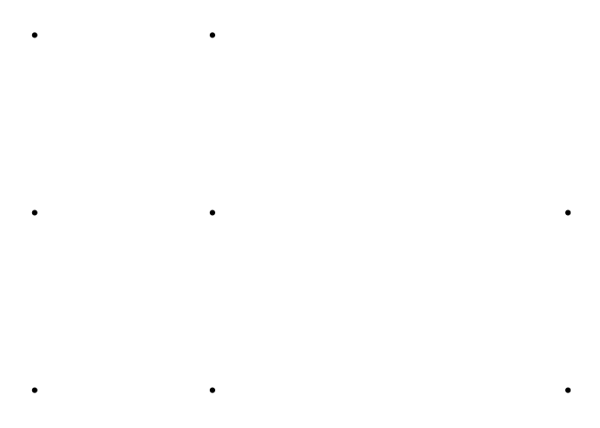
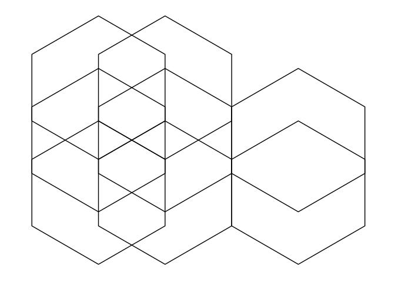
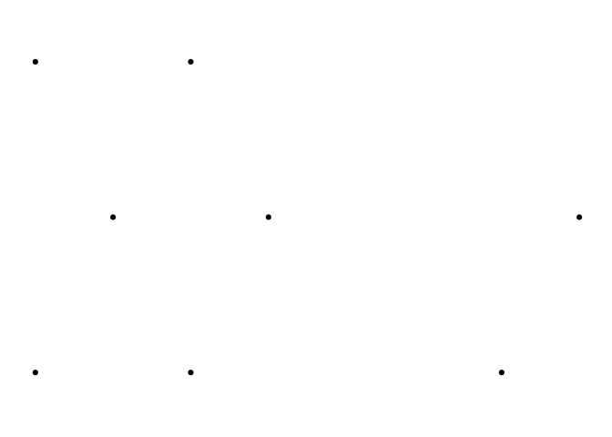
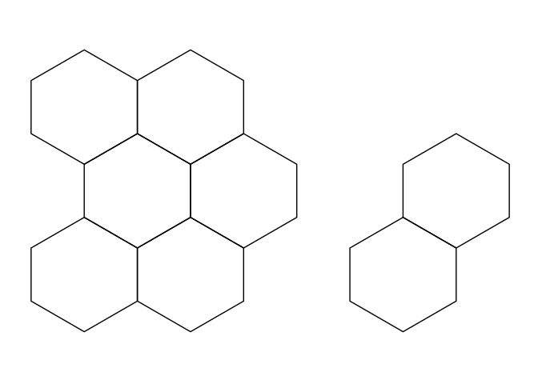
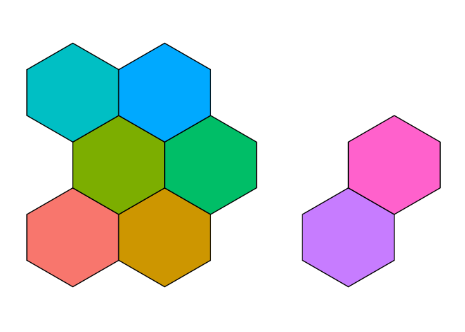

<!-- README.md is generated from README.Rmd. Please edit that file -->
[](http://cran.r-project.org/package=hexamapmaker)

hexamapmaker
============

The goal of `hexamapmaker` is to turn points into hexagons. `hexamapmaker` takes a set of points in a x and y coordinate and turns them into hexagons. The idea is, that you can quickly design the layout of a hexagon map by just adding points in a coordinate system. Then the hexamap function turns them into hexagon-shaped polygons that can be plotted with `ggplot2`.

Installation
------------

You can install hexamapmaker from github with:

``` r
# install.packages("devtools")
devtools::install_github("mikkelkrogsholm/hexamapmaker")
```

Example
-------

This is a basic example which shows you how to make a hexamap:

``` r
# Load libraries
library(hexamapmaker)
library(ggplot2)
library(tibble)
library(ggthemes)
```

``` r
# Points on a "normal" grid.
my_points <- tibble::tibble(
  x = c(1, 2, 1, 2, 1, 2, 4, 4),
  y = c(1, 1, 2, 2, 3, 3, 1, 2),
  id = c("test1", "test2", "test3", "test4", "test5", "test6", "test7", "test8")
)

# Plot the points
ggplot(my_points, aes(x = x, y = y, group = id)) +
  geom_point() +
  coord_fixed(ratio = 1) +
  theme_map()
```



``` r
# Turn points into hexagons
hexa_points <- make_polygons(my_points)
#> MMHM! Your new hexagon map is awesome!

# Plot the new hexagons
ggplot(hexa_points, aes(x, y, group = id)) +
  geom_polygon(colour = "black", fill = NA) +
  coord_fixed(ratio = 1) +
  theme_map()
```



``` r
# Oh no! It is way off - lets fix it.
my_points <- fix_shape(my_points)

# Plot points
ggplot(my_points, aes(x = x, y = y, group = id)) +
  geom_point() +
  coord_fixed(ratio = 1) +
  theme_map()
```



``` r
# Turn points into hexagons
hexa_points <- make_polygons(my_points)
#> AWW! Your new hexagon map is astounding!

ggplot(hexa_points, aes(x, y, group = id)) +
  geom_polygon(colour = "black", fill = NA) +
  coord_fixed(ratio = 1) +
  theme_map()
```



``` r
# Add color by using the fill argument in ggplot.
# Remember to remove it from the geom_polygon then
(p <- ggplot(hexa_points, aes(x, y, group = id, fill = id)) +
    geom_polygon(colour = "black", show.legend = FALSE) +
    coord_fixed(ratio = 1) +
    theme_map())
```



``` r

# Label hexagons
add_hexalabel(hexa_points, p)
```


